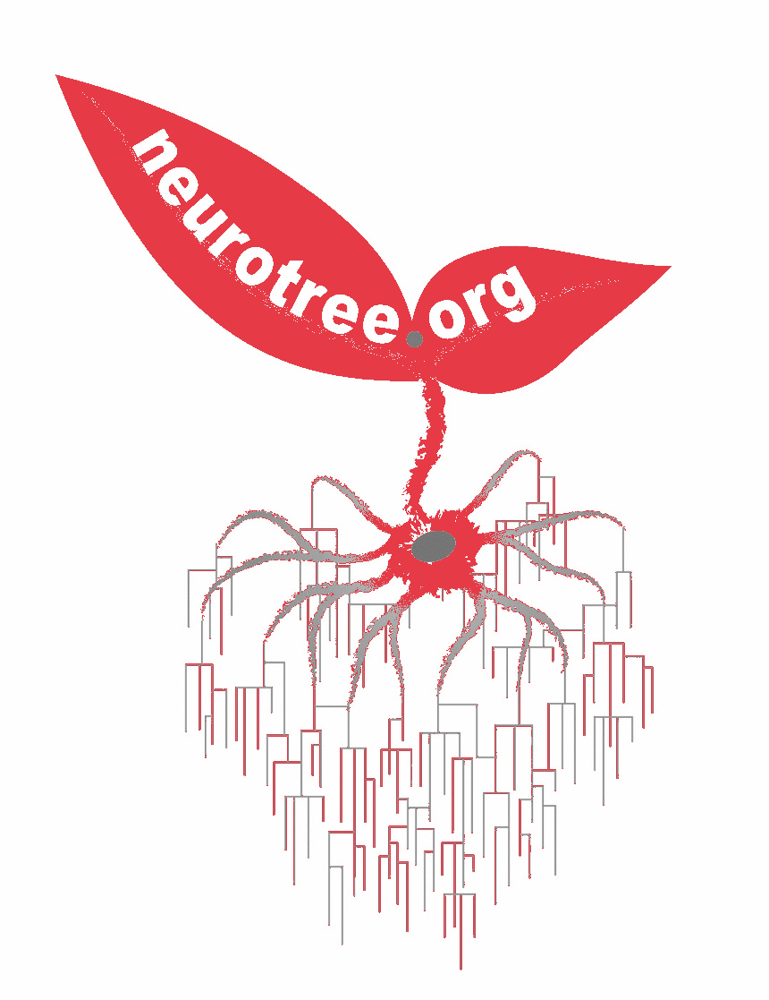
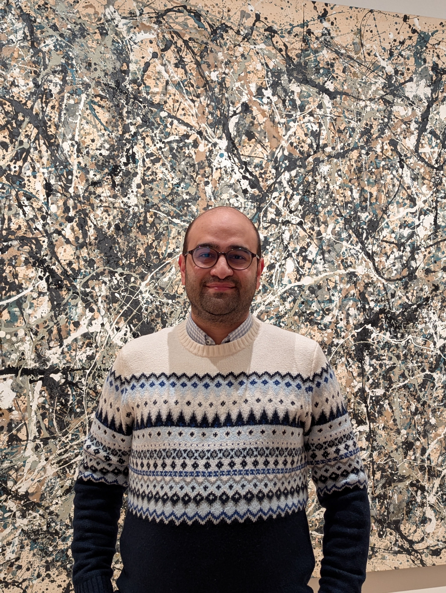

```{=html}
<!-- ==========================================
     HERO SECTION
     ========================================== -->
<section class="hero-section">
  <div class="hero-inner">

    <!-- Left: Text Content -->
    <div class="hero-content">
      <div class="availability-pill">
        Open to Full-Time Roles — Summer / Fall 2026
      </div>
      <h1 class="hero-name">Mohammad Dastgheib</h1>
      <p class="hero-title">
        Cognitive Neuroscientist &amp; Human Factors Researcher
      </p>
      <p class="hero-bio">
        I use psychophysics, pupillometry, and Bayesian modeling to understand 
        how humans make decisions under pressure — and build systems that adapt 
        to them. Targeting roles in Human Factors, Quant UXR, and Research 
        Scientist positions in AR/VR/XR.
      </p>
      <div class="hero-ctas">
        <a href="/portfolio/portfolio.html" class="btn btn-primary btn-lg">
          View Portfolio
        </a>
        <a href="/CV/CV_MDastgheib.pdf" class="btn btn-outline-secondary btn-lg" target="_blank">
          <i class="fas fa-download" style="margin-right:0.4em;"></i>Download CV
        </a>
      </div>
      <div class="hero-social">
        <a href="mailto:m.dastgheib@gmail.com" title="Email" aria-label="Email">
          <i class="fas fa-envelope"></i>
        </a>
        <a href="https://linkedin.com/in/mdastgheib" title="LinkedIn" aria-label="LinkedIn" target="_blank" rel="noopener">
          <i class="fab fa-linkedin"></i>
        </a>
        <a href="https://scholar.google.com/citations?user=SNVpHcUAAAAJ" title="Google Scholar" aria-label="Google Scholar" target="_blank" rel="noopener">
          <i class="ai ai-google-scholar"></i>
        </a>
        <a href="https://github.com/mohdasti" title="GitHub" aria-label="GitHub" target="_blank" rel="noopener">
          <i class="fab fa-github"></i>
        </a>
        <a href="https://orcid.org/0000-0001-7684-3731" title="ORCID" aria-label="ORCID" target="_blank" rel="noopener">
          <i class="ai ai-orcid"></i>
        </a>
        <a href="https://neurotree.org/neurotree/tree.php?pid=860425" title="Neurotree" aria-label="Neurotree" target="_blank" rel="noopener">
          
        </a>
      </div>
    </div>

    <!-- Right: Profile Photo -->
    <div class="hero-photo-wrap">
      <div class="hero-photo-ring">
        
      </div>
    </div>

  </div>
</section>

<!-- ==========================================
     STATS BAR
     ========================================== -->
<section class="stats-bar">
  <div class="stats-inner">
    <div class="stat-callout">
      <span class="stat-number">4</span>
      <span class="stat-label">Portfolio Case Studies</span>
    </div>
    <div class="stat-divider"></div>
    <div class="stat-callout">
      <span class="stat-number">5+</span>
      <span class="stat-label">Publications &amp; Preprints</span>
    </div>
    <div class="stat-divider"></div>
    <div class="stat-callout">
      <span class="stat-number">PhD</span>
      <span class="stat-label">Cognitive Neuroscience, UC Riverside</span>
    </div>
    <div class="stat-divider"></div>
    <div class="stat-callout">
      <span class="stat-number">arXiv</span>
      <span class="stat-label">XR / HCI Preprint Published</span>
    </div>
  </div>
</section>

<!-- ==========================================
     FEATURED WORK
     ========================================== -->
<section class="featured-section">
  <div class="featured-inner">
    <h2 class="section-heading">Featured Work</h2>
    <p class="section-subheading">
      Two lines of applied research — directly relevant to industry roles in AR/VR and Human Factors.
    </p>
    <div class="featured-grid">

      <!-- Card 1: XR Work -->
      <article class="project-card featured-card">
        <div class="card-role-tag">
          <i class="fas fa-vr-cardboard"></i> Featured for AR/VR Roles
        </div>
        <h3 class="card-title">Hand vs. Gaze Interaction in XR</h3>
        <p class="card-outcome">→ Remote XR testbed · Adaptive UI · arXiv preprint · Bayesian LBA</p>
        <p class="card-desc">
          Built a fully remote, web-based XR-relevant interaction testbed in React/TypeScript.
          Compared hand and gaze pointing modalities using ISO 9241-9 Fitts' law, NASA-TLX, 
          and hierarchical Bayesian LBA modeling. Evaluated context-aware adaptive UI policies 
          for reducing gaze failure modes.
        </p>
        <div class="card-tags">
          <span class="skill-badge teal">XR / HCI</span>
          <span class="skill-badge teal">Gaze Interaction</span>
          <span class="skill-badge teal">Fitts' Law</span>
          <span class="skill-badge teal">Bayesian LBA</span>
          <span class="skill-badge teal">React / TypeScript</span>
          <span class="skill-badge teal">arXiv</span>
        </div>
        <a href="/projects/case_study_web.html" class="card-cta">
          View Case Study <i class="fas fa-arrow-right"></i>
        </a>
      </article>

      <!-- Card 2: Human Factors Work -->
      <article class="project-card featured-card teal-accent">
        <div class="card-role-tag teal-tag">
          <i class="fas fa-brain"></i> Featured for Human Factors Roles
        </div>
        <h3 class="card-title">Surgeon Cognitive Dashboard</h3>
        <p class="card-outcome">→ Live Shiny app · XGBoost + Platt calibration · Zero wearables</p>
        <p class="card-desc">
          Designed and deployed a real-time cognitive state monitoring dashboard for robotic 
          surgery training. Fuses pupillometry, HRV, and grip/tremor signals via XGBoost.  
          Three pedagogically-grounded threshold policies. No headgear, &lt;60s setup.
        </p>
        <div class="card-tags">
          <span class="skill-badge">Human Factors</span>
          <span class="skill-badge">Pupillometry</span>
          <span class="skill-badge">XGBoost / ML</span>
          <span class="skill-badge">R Shiny</span>
          <span class="skill-badge">Signal Detection Theory</span>
        </div>
        <a href="/projects/surgeon-performance-predict2.html" class="card-cta">
          View Case Study <i class="fas fa-arrow-right"></i>
        </a>
      </article>

    </div>
    <div style="text-align:center; margin-top:2rem;">
      <a href="/portfolio/portfolio.html" class="btn btn-outline-secondary">
        See All Case Studies <i class="fas fa-arrow-right" style="margin-left:0.3em;"></i>
      </a>
    </div>
  </div>
</section>

<!-- ==========================================
     CONTACT / CTA SECTION
     ========================================== -->
<section class="contact-section">
  <div class="contact-inner">
    <h2 class="contact-heading">Open to Opportunities</h2>
    <p class="contact-sub">
      Seeking full-time roles (Summer / Fall 2026) in Human Factors, UX Research, or 
      Research Scientist positions — especially in AR/VR/XR and human performance contexts.
    </p>
    <div class="contact-buttons">
      <a href="mailto:m.dastgheib@gmail.com" class="btn btn-primary btn-lg">
        <i class="fas fa-envelope" style="margin-right:0.5em;"></i>Email Me
      </a>
      <a href="https://linkedin.com/in/mdastgheib" class="btn btn-outline-secondary btn-lg" target="_blank" rel="noopener">
        <i class="fab fa-linkedin" style="margin-right:0.5em;"></i>LinkedIn
      </a>
      <a href="https://scholar.google.com/citations?user=SNVpHcUAAAAJ" class="btn btn-outline-secondary btn-lg" target="_blank" rel="noopener">
        <i class="ai ai-google-scholar" style="margin-right:0.5em;"></i>Google Scholar
      </a>
    </div>
  </div>
</section>
```
